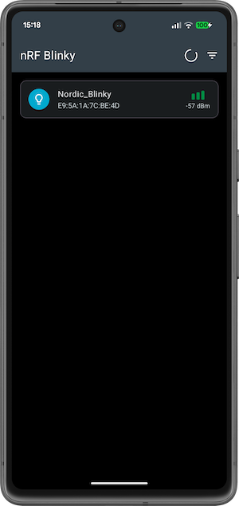
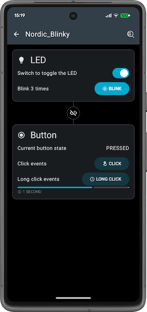

# nRF BLINKY

nRF Blinky is an application developed targeting an audience of developers who are new to 
Bluetooth Low Energy. 

This is a very simple application with two basic features to turn on LED 3 
on the nRF DK and to receive the Button 1 press event from a nRF DK on the nRF Blinky Application.

 

It demonstrates how to the **BleManager** class from 
[Android BLE Library](https://github.com/NordicSemiconductor/Android-BLE-Library/) 
library can be used from View Model 
(see [Architecture Components](https://developer.android.com/topic/libraries/architecture/index.html)).

## Nordic LED and Button Service

Service UUID: `00001523-1212-EFDE-1523-785FEABCD123`

A simplified proprietary service by Nordic Semiconductor, containing two characteristics one to 
control LED 3 and Button 1:

- First characteristic controls the LED state (On/Off).
  - UUID: **`00001525-1212-EFDE-1523-785FEABCD123`**
  - Value: **`1`** => LED On
  - Value: **`0`** => LED Off

- Second characteristic notifies central of the button state on change (Pressed/Released).
  - UUID: **`00001524-1212-EFDE-1523-785FEABCD123`**
  - Value: **`1`** => Button Pressed
  - Value: **`0`** => Button Released
  
For documentation for nRF5 SDK, check out 
[this link](https://infocenter.nordicsemi.com/topic/sdk_nrf5_v17.1.0/ble_sdk_app_blinky.html?cp=8_1_4_2_2_3)
and for one based on nRF Connect SDK 
[this link](https://developer.nordicsemi.com/nRF_Connect_SDK/doc/latest/nrf/samples/bluetooth/peripheral_lbs/README.html).

## Requirements

* This application depends on [Android BLE Library](https://github.com/NordicSemiconductor/Android-BLE-Library/).
* Android 4.3 or newer is required.
* Any nRF5 DK is required in order to test the BLE Blinky service. The service can also be emulated
using nRF Connect for Android, iOS or Desktop.

## Installation and usage

Flash your device with LED Button sample from nRF5 SDK or nRF Connect SDK.

The device should appear on the scanner screen after granting required permissions.

### Required permissions

On Android 6 - 11 nRF Blinky will ask for Location Permission and Location services. 
This permission is required on Android in order to obtain Bluetooth LE scan results. The app does not
use location in any way and has no Internet permission so can be used safely.

This permission is not required from Android 12 onwards, where new 
[Bluetooth permissions](https://developer.android.com/guide/topics/connectivity/bluetooth/permissions)
were introduced. The `BLUETOOTH_SCAN` permission can now be requested with 
`usesPermissionFlags="neverForLocation"` parameter, which excludes location related data from the
scan results, making requesting location not needed anymore.