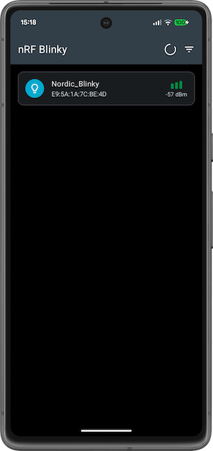
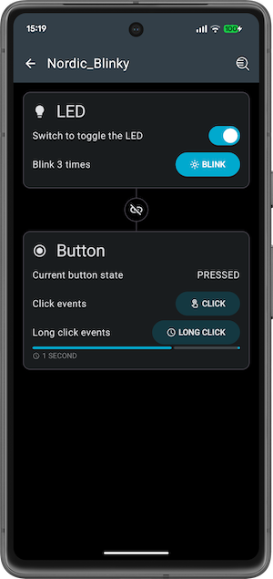

# nRF Blinky for Android

nRF Blinky is an application targeting an audience of developers who are new to 
Bluetooth Low Energy. 

The app can be easily modified to work with other devices and may act as a template app.

This very simple application contains two basic features:
* turning on a LED on a connected Bluetooth LE device,
* receiving a Button press and release events from the device.

Based on these 2 states, the derived flows allow to detect:
* button click events (press and release),
* long button click events (pressed for longer than 1 second).

nRF Blinky demonstrates how to implement basic Bluetooth LE operations (blinking)
or binding flows and states (control the LED state based on the button state).

 

## Kotlin BLE Library

This app is designed to work as a sample app for the 
[Kotlin BLE Library](https://github.com/NordicSemiconductor/Kotlin-BLE-Library/).
It demonstrates how a connection can be handled using a
[Service](https://developer.android.com/develop/background-work/services) with a clear
separation of the Bluetooth LE logic from the App using a 
[Blinky](https://github.com/NordicSemiconductor/Android-nRF-Blinky/blob/main/blinky/spec/src/main/java/no/nordicsemi/android/blinky/spec/Blinky.kt)
interface.

The Bluetooth LE logic is implemented in the 
[LedButtonServiceImpl](https://github.com/NordicSemiconductor/Android-nRF-Blinky/blob/main/blinky/ble/src/main/java/no/nordicsemi/android/blinky/ble/LedButtonServiceImpl.kt)
class, which is injected as a ["profile"](https://github.com/NordicSemiconductor/Android-nRF-Blinky/blob/main/blinky/ble/src/main/java/no/nordicsemi/android/blinky/ble/BlinkyManager.kt#L34-L49). 

## Structure

The nRF Blinky application has been created in Jetpack Compose.

### Dependencies

It is using the following libraries:
* [Kotlin BLE Library](https://github.com/NordicSemiconductor/Kotlin-BLE-Library/) - handles Bluetooth LE connectivity
* [Nordic Common Library for Android](https://github.com/NordicSemiconductor/Android-Common-Libraries) - theme and common UI components, e.g. scanner screen
* [nRF Logger tree for Timber](https://github.com/NordicSemiconductor/nRF-Logger-API) - logs to nRF Logger app using [Timber](https://github.com/JakeWharton/timber)
* [Nordic Gradle Plugins](https://github.com/NordicSemiconductor/Nordic-Gradle-Plugins) - set of Gradle plugins for building and deployment

The Gradle script is using version catalog for dependency management.

### Modules

The application consists of the following modules:

* **:app** - the main module, contains the application code
* **:scanner** - contains the scanner screen navigation entry
* **:blinky:spec** - contains the Blinky device specification, i.e. [`Blinky`](https://github.com/NordicSemiconductor/Android-nRF-Blinky/blob/main/blinky/spec/src/main/java/no/nordicsemi/android/blinky/spec/Blinky.kt) API or the Service UUID
* **:blinky:ble** - contains the BLE related code, i.e. [`BlinkyManager`](https://github.com/NordicSemiconductor/Android-nRF-Blinky/blob/main/blinky/ble/src/main/java/no/nordicsemi/android/blinky/ble/BlinkyManager.kt) implementation
* **:blinky:ui** - contains the UI related code, i.e. [`BlinkyScreen`](https://github.com/NordicSemiconductor/Android-nRF-Blinky/blob/main/blinky/ui/src/main/java/no/nordicsemi/android/blinky/ui/control/view/BlinkyScreen.kt)
  or [`BlinkyViewModel`](https://github.com/NordicSemiconductor/Android-nRF-Blinky/blob/main/blinky/ui/src/main/java/no/nordicsemi/android/blinky/ui/control/viewmodel/BlinkyViewModel.kt) implementation,
  and the [`BlinkyService`](https://github.com/NordicSemiconductor/Android-nRF-Blinky/blob/main/blinky/ui/src/main/java/no/nordicsemi/android/blinky/ui/control/service/BlinkyService.kt) 

The **:blinky:ui** and **:blinky:spec** modules are transport agnostic. 
The Bluetooth LE transport is specified in the **:app** module using Hilt [here](https://github.com/NordicSemiconductor/Android-nRF-Blinky/blob/main/app/src/main/java/no/nordicsemi/android/blinky/di/BlinkyModule.kt). 

The app is using [Navigation 3](https://developer.android.com/guide/navigation/navigation-3).
The **:app** module defines navigation in [App](https://github.com/NordicSemiconductor/Android-nRF-Blinky/blob/main/app/src/main/java/no/nordicsemi/android/blinky/MainActivity.kt#L46-L72) composable.
The entries are defined in the [**:scanner**](https://github.com/NordicSemiconductor/Android-nRF-Blinky/blob/main/scanner/src/main/java/no/nordicsemi/android/scanner/ScannerDestination.kt#L11-L19) 
and [**:blinky:ui**](https://github.com/NordicSemiconductor/Android-nRF-Blinky/blob/main/blinky/ui/src/main/java/no/nordicsemi/android/blinky/ui/control/BlinkyDestination.kt#L17-L24) modules.

## Nordic LED and Button Service (LBS)

Service UUID: `00001523-1212-EFDE-1523-785FEABCD123`

A simplified proprietary service by Nordic Semiconductor, containing two characteristics:

- LED state (On/Off).
  - UUID: **`00001525-1212-EFDE-1523-785FEABCD123`**
  - Properties: **Write** or **Write Without Response**
    - Value: **`0x01`** => LED On
    - Value: **`0x00`** => LED Off

- Button state (Pressed/Released).
  - UUID: **`00001524-1212-EFDE-1523-785FEABCD123`**
  - Properties: **Notify**
    - Value: **`0x01`** => Button Pressed
    - Value: **`0x00`** => Button Released
  
For documentation for nRF5 SDK, check out [this link](https://developer.nordicsemi.com/nRF_Connect_SDK/doc/latest/nrf/samples/bluetooth/peripheral_lbs/README.html).

## Requirements

* This application depends on [Kotlin BLE Library](https://github.com/NordicSemiconductor/Kotlin-BLE-Library/).
* Android 6 or newer is required.
* Any nRF5 DK or another device is required in order to test the BLE Blinky service. The service 
  can also be emulated using nRF Connect for Android, iOS or Desktop.

## Installation and usage

Program your device with LED Button sample from nRF Connect SDK ([Peripheral LBS sample]((https://developer.nordicsemi.com/nRF_Connect_SDK/doc/latest/nrf/samples/bluetooth/peripheral_lbs/README.html))).

The device should appear on the scanner screen after granting required permissions.

### Required permissions

* `ACCESS_FINE_LOCATION` - On Android 6 - 11 nRF Blinky will ask for Location 
   Permission and Location services. This permission is required on Android in order to obtain 
   Bluetooth LE scan results. The app does not use location in any way.

> [!Note]
> This permission is not required from Android 12 onwards, where new 
> [Bluetooth permissions](https://developer.android.com/guide/topics/connectivity/bluetooth/permissions)
> were introduced. The `BLUETOOTH_SCAN` permission can now be requested with 
> `usesPermissionFlags="neverForLocation"` parameter, which excludes location related data from the
> scan results, making requesting location not needed anymore.

* `POST_NOTIFICATIONS` - permissions is used for showing a foreground service notification, which 
  allows to control the LED state when the app is in background.

* `VIBRATE` - required to vibrate when the Button on a DK is pressed.

* `FOREGROUND_SERVICE` and `FOREGROUND_SERVICE_CONNECTED_DEVICE` are needed for the `Service` to be
  started as a [foreground service](https://developer.android.com/develop/background-work/services/fgs).